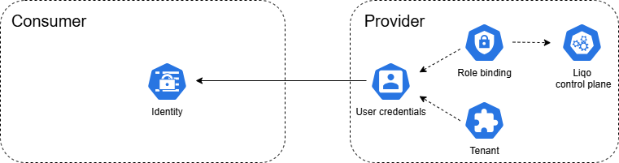

# ArgoCD Setup

[ArgoCD](https://argo-cd.readthedocs.io) can be used to deploy and synchronize the various Custom Resources (CRs) required for establishing a Liqo peering. This guide outlines the procedure to deploy a unidirectional peering between two clusters — a consumer and a provider — using ArgoCD installed on the consumer cluster. Both clusters must be registered and accessible from the consumer ArgoCD server in order to deploy the necessary CRs. This guide demonstrates how to configure a unidirectional Liqo peering using ArgoCD across three phases:

- [Networking](#net)

- [Authentication](#auth)

- [Offloading](#offloading)

All resources are deployed using ArgoCD Applications and must be customized to match the specific environment. 

## <a id="net"></a>Declarative Network Configuration

Sample ArgoCD applications for this phase are available in the [argocd-app folder](./argocd-app). These applications deploy the CRs located in the [net-local](./net-local) (consumer cluster) and [net-remote](./net-remote) (provider cluster) directories. The CRs provided include randomly generated example data (e.g., WireGuard keys); such data must be adapted to fit the specific target environment. The following section summarizes the parameters that may be customized arbitrarily and those that are dependent on the underlying infrastructure.

>**Note** 
ArgoCD enforces stricter validation rules on CRs compared to manual deployment. In particular, the `Configuration` CR, being namespace-scoped, must be created within a namespace. In this guide it is placed in the tenant namespace for simplicity, since it is related to the peering process.

Although the networking phase will only complete successfully once all CRs are applied to their respective clusters, there is no required order of deployment. The peering will become fully operational even if local CRs are applied first and remote CRs are added at a later time.


During this phase, the following resources are deployed:

1. **Tenant `Namespace`** (on both clusters): Hosts all Custom Resources (CRs) associated with the peering process. Each tenant namespace must correspond to a specific remote cluster, meaning that a dedicated namespace must be created for each peering.

2. **`Configuration`** (on both clusters): Stores the network configuration required to establish the connection. Each cluster must be configured with the networking parameters of the other.

3. **Wireguard keys `Secret` and `Publickey`** (on both clusters): Contain the cryptographic material (private and public keys) used to establish the WireGuard tunnel between clusters.

4. **`GatewayServer`** (on the provider cluster): Acts as the endpoint of the WireGuard tunnel and must be reachable by the consumer cluster. In the provided example, a NodePort Gateway Server is used, assuming that both clusters reside within the same network. The Gateway Client then references the IP address of the node hosting the Gateway Server.

5. **`GatewayClient`** (on the consumer cluster): Initiates the connection to the provider’s exposed WireGuard service, using the configuration and public key data provided.

If the setup is completed correctly, running the `liqoctl info` command on one of the clusters will return output similar to the following:

```bash
┌─ Active peerings ────────────────────────────────────────────────────────────────┐
|  consumer                                                                        |
|      Role:                  Unknown                                              |
|      Networking status:     Healthy                                              |
|      Authentication status: Disabled                                             |
|      Offloading status:     Disabled                                             |
└──────────────────────────────────────────────────────────────────────────────────┘
```

## <a id="auth"></a>Declarative Configuration of Cluster Authentication

This section outlines the steps required to declaratively configure authentication between clusters, allowing the consumer cluster to request and manage resources on the provider cluster.

The consumer cluster must be granted credentials that authorize interactions with the provider cluster, and **it is the user’s responsibility to supply credentials with the appropriate permissions** using the associated kubeconfig inside the `Identity` resource.

Example ArgoCD applications for this phase are available in the [argocd-app folder](./argocd-app). These applications deploy the required Custom Resources (CRs) located in the [auth-local](./auth-local) (consumer cluster) and [auth-remote](./auth-remote/) (provider cluster) directories. The provided CRs include randomly generated example data (e.g., base64-encoded kubeconfig); this data must be modified to suit the specific target environment.

<br>

During this phase, the following resources are deployed:

1. **`Rolebinding`** (on the provider cluster): Grants limited permissions to the customer cluster credentials by binding it to the Liqo control-plane, allowing the creation of Liqo-specific resources such as ResourceSlice objects.

2. **`Tenant`** (on the provider cluster): Manages authorization policies for the remote consumer cluster.

3. **`Identity`** (on the consumer cluster): A Kubernetes Secret containing the credentials generated on the provider cluster.

Once this Secret is created, the `liqo-crd-replicator` component running in the consumer cluster begins the replication process and enables the creation of `ResourceSlice` resources targeting the provider cluster. This allows the consumer to begin negotiating resources with the provider.


## <a id="offloading"></a>Declarative Configuration of Namespace Offloading

This section describes the procedure for declaratively configuring namespace offloading between clusters, enabling the consumer cluster to offload workloads to a provider cluster.

While offloading is independent from the network, which means that it is possible to negotiate resources and configure a namespace offloading without the inter-cluster network enabled, **a [working authentication configuration](#declarative-configuration-of-clusters-authentication) is a pre-requisite to enable offloading**.


An example ArgoCD application for this phase is available in the [argocd-app folder](./argocd-app). This application is deployed only in the local (consumer) cluster, as the necessary resources in the provider cluster are automatically propagated by Liqo. The application deploys the required Custom Resources (CRs) located in the [offloading-local](./offloading-local/) directory. The provided CRs contain randomly generated sample data (e.g., resource requests); such data must be adjusted to match the specific environment and requirements.

The following resources are deployed during this phase:

1. **`ResourceSlice`** Defines the computational resources requested by the consumer cluster from a provider cluster. This resource is automatically propagated to the provider cluster, which may either accept or reject the request. If accepted, a virtual node is created in the consumer cluster. This node represents the available resources and acts as a proxy for the provider cluster.
For additional details on the `ResourceSlice` and `VirtualNode` resources, refer to [the dedicated documentation section](https://docs.liqo.io/en/latest/advanced/peering/offloading-in-depth.html#create-resourceslice).

2. **`NamespaceOffloading`**  Enables the offloading of a specific namespace, allowing the associated workloads to be scheduled on the remote provider cluster.

If the setup is completed correctly, running the `liqoctl info` command on one of the clusters will return output similar to the following:

```bash
┌─ Active peerings ────────────────────────────────────────────────────────────────┐
|  provider                                                                        |
|      Role:                  Provider                                             |
|      Networking status:     Healthy                                              |
|      Authentication status: Disabled                                             |
|      Offloading status:     Healthy                                              |
└──────────────────────────────────────────────────────────────────────────────────┘

>**Note** Currently, the `NamespaceOffloading` resource **must be created before scheduling any pod** intended to run on a remote cluster.  
If a pod is created before the namespace has been offloaded, it will remain indefinitely in the `Pending` state—even after the offloading configuration is applied.  
**It is therefore crucial to offload the namespace first**, before initiating pod scheduling.